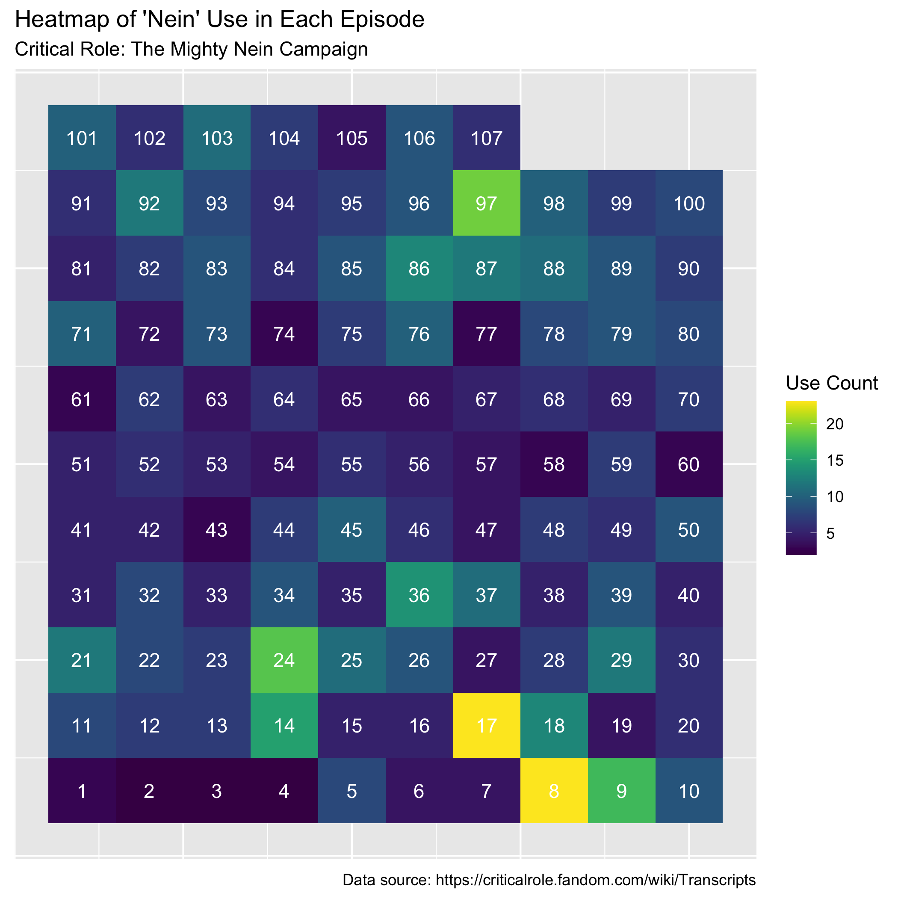

```{r, echo = F, message=FALSE, warning= FALSE}
library(leaflet)
library(shiny)
library(DT)
library(sp)
library(raster)
# library(colorRamps)
library(RColorBrewer)
library(tidyr)
library(dplyr)
library(readr)
library(stringr)
library(rgdal)
library(htmlwidgets)
library(htmltools)
library(geojsonio)


filter <- dplyr::filter


load("HMM_48hr.Rdata")
load("All_48hr.Rdata")

load("HMM_24hr.Rdata")
load("All_24hr.Rdata")


```

This document serves as application materials for the position of Data Manager/Scientist at Montana State University. It was compiled and submitted to the interview panel on 18 February, 2022. 

# Samples of Data Visualization

Three data visualization examples are included below. Two stem from research projects during my PhD in Statistics at Pennsylvania State Universities and another from a fun side project. 

## 1. Explaining a Concept

This figure is included in the publication, "Identifying and characterizing extrapolation in multivariate response data", available online [here](https://journals.plos.org/plosone/article?id=10.1371/journal.pone.0225715). 

The objective of this figure is to use a simple, yet contextually motivated, visualization to aide readers in understanding the concept of extrapolation. By using two variables from the data used in this method papers application the readers are (1) able to visualize the risk of predicting new values using model fit on specific data ranges and (2) shown why understanding extrapolation is vital using lake nutrient data that is the motivating dataset in this work. 

From this publication, 
 "When we use a model fit on available data to predict a value or values at a new location, it is important to consider how dissimilar this new observation is to previously observed values. If some or many covariate values of this new point are dissimilar enough from those used when the model was fitted (i.e. either because they are outside the range of individual covariates or because they are a novel combination of covariates) predictions at this point may be unreliable.
[This figure], adapted from work by Filstrup et al. [2], illustrates this risk with a simple linear regression between the log transformed measurements of total phosphorous (TP) and chlorophyll a (Chl a) in U.S. lakes. The data shown in blue were used to fit a linear model with the estimated regression line shown in the same color. While the selected range of data may be reasonably approximated with a linear model, the linear trend does not extend into more extreme values, and thus our model and predictions are no longer appropriate."

Code for creating this figure is available [here](https://github.com/MLBartley/MV_extrapolation/blob/master/R/06.01_visualize_ExtrapConcept.R).

Data Citation:

Soranno P., K. Cheruvelil. 2019. LAGOS-NE-LIMNO v1.087.3: A module for LAGOS-NE, a multi-scaled geospatial and temporal database of lake ecological context and water quality for thousands of U.S. Lakes: 1925-2013. Environmental Data Initiative.
https://doi.org/10.6073/pasta/08c6f9311929f4874b01bcc64eb3b2d7  

```{r fig:extrapolation, echo=FALSE, fig.cap="A 95% confidence interval of the mean is included around the regression line. Dashed red lines represents the 95% prediction interval. Areas shaded in darker grey indicate regions of extrapolation (using the maximum leverage value (hii) to identify the boundaries).", out.width = '100%'}
knitr::include_graphics("Figures/extrapolation.png")
```


## 2. Interactive Map

This interactive map graphic was created to visualize bird satellite telemetry data. It has not be published and should not be considered a final version, rather a useful tool that can be used internally during analysis of such data. Tracking data locations have been changed as these data have not yet been published by the data providers. As such, the focus of this visual is not the data, but rather the interactive map and features themselves. Code used to create this embedded shiny app is included in this Markdown file (but not in the knitted document). Associated files (e.g. fake location data and associated .js and .css files) are also included. 

An interactive map is useful for sharing with data providers, data analysts, even the public. Errors in tracking data are not uncommon and visualizations like this making finding questionable locations easy to spot and inspect. Unlike a static map of tracking locations, this interactive graphic can easily subset data and change the focus of interest (e.g. changing variable used for coloring the locations) in real time. Long term applications of such a graphic include inclusion as a supplementary material in data and/or methods papers or even as an educational tool for the public to learn about a specific species' migration path. 


```{r, echo = FALSE, message=FALSE, warning=FALSE}

## user interface object

color_vars <- c(
  "Population" = "site",
  "ID" = "ID",
  "Migration State" = "state",
  # "Stop Frequency" = "Stop_Freq",
  "Stopover Probability" = "Prob_StopoverState",
  "Year" = "year", 
  "Season" = "season")

size_vars <- c( "All Same" = "same",
                # "Population" = "site",
                # "ID" = "ID",
                "Stop Frequency" = "Stop_Freq" 
                # "Year" = "year", 
                # "Season" = "season"
)

subset_vars <- c("All" = "all",
                 "Population" = "site",
                 "ID" = "ID",
                 # "Stop Frequency" = "Stop_Freq", 
                 "Year" = "year", 
                 "Season" = "season")

# Define UI for app that draws a histogram ----
ui <- navbarPage("Long-billed Curlew Stopover Sites", id="nav",
                 
                 tabPanel("Interactive map",
                          div(class="outer",
                              
                              tags$head(
                                # Include our custom CSS
                                includeCSS("styles.css"),
                                includeScript("gomap.js")
                              ),
                              
                              # If not using custom CSS, set height of leafletOutput to a number instead of percent
                              leafletOutput("map", width="100%", height="100%"),
                              
                              # Shiny versions prior to 0.11 should use class = "modal" instead.
                              absolutePanel(id = "controls", class = "panel panel-default", 
                                            fixed = TRUE,
                                            draggable = TRUE, top = 60, 
                                            left = "auto", right = 20, 
                                            bottom = "auto",
                                            width = 330, height = "auto",
                                            
                                            h2("Stopover explorer"),
                                            
                                            selectInput("data", "Which Data", 
                                                        choices = c( 
                                                          # "All", ## need to join dataframes? 
                                                          "Migration",
                                                          "Stopovers", 
                                                          "Migration + Stopovers",
                                                          "Stopover Centroid")),
                                            selectInput("color", "Color", color_vars),
                                            selectInput("size", "Size", size_vars, selected = "same"),
                                            selectInput("subset", "Subset By", subset_vars, selected = "all"),
                                            uiOutput("secondSelection"),
                                            radioButtons("interval", h3("Path Interval Length"),
                                                         choices = list("24 Hours", "48 Hours"), selected = "48 Hours"),
                                            checkboxInput("lines", "Add Path Lines", value = FALSE)
                                            # conditionalPanel("input.color == 'superzip' || input.size == 'superzip'",
                                            # Only prompt for threshold when coloring or sizing by superzip
                                            # numericInput("threshold", "SuperZIP threshold (top n percentile)", 5)
                                            # ),
                                            
                                            # plotOutput("histCentile", height = 200),
                                            # plotOutput("scatterCollegeIncome", height = 250)
                              ),
                              
                              tags$div(id="cite",
                                       'Data compiled for ', tags$em('Coming Apart: The State of White America, 1960–2010'), ' by Charles Murray (Crown Forum, 2012).'
                              )
                          )
                 ),
                 
                 # tabPanel("Data explorer",
                 #          DT::dataTableOutput("table")                 #          fluidRow(
                 # #            column(3,
                 # #                   selectInput("states", "States", c("All states"="", structure(state.abb, names=state.name), "Washington, DC"="DC"), multiple=TRUE)
                 # #            ),
                 # #            column(3,
                 # #                   conditionalPanel("input.states",
                 # #                                    selectInput("cities", "Cities", c("All cities"=""), multiple=TRUE)
                 # #                   )
                 # #            ),
                 # #            column(3,
                 # #                   conditionalPanel("input.states",
                 # #                                    selectInput("zipcodes", "Zipcodes", c("All zipcodes"=""), multiple=TRUE)
                 # #                   )
                 # #            )
                 # #          ),
                 # #          fluidRow(
                 # #            column(1,
                 # #                   numericInput("minScore", "Min score", min=0, max=100, value=0)
                 # #            ),
                 # #            column(1,
                 # #                   numericInput("maxScore", "Max score", min=0, max=100, value=100)
                 # #            )
                 # #          ),
                 # #          hr(),
                 # #          DT::dataTableOutput("ziptable")
                 # ),
                 # tabPanel("Data summary",
                 #          DT::dataTableOutput("summary")
                 # ),
                 conditionalPanel("false", icon("crosshair"))
)


## server function
server <- function(input, output, session) {
  
  # Subset By - takes choice from input to subset which stopover locations are plotted
  
  lldata <- reactive({
    if (input$interval == "48 Hours"){
      lldata <- All_48
      lldata$layerID <- 1:nrow(lldata)
    } else {
      lldata <- All_24
      lldata$layerID <- 1:nrow(lldata)
    }
    
    return(lldata)
  })
  
  HMM_summ <- reactive({
    if (input$interval == "48 Hours"){
      HMM_summ <- HMM_48 #just to stay on track with existing code
      HMM_summ$layerID <- 1:nrow(HMM_summ)
      HMM_summ$state <- rep(2, nrow(HMM_summ))
      
    } else {
      HMM_summ <- HMM_24 #just to stay on track with existing code
      HMM_summ$layerID <- 1:nrow(HMM_summ)
      HMM_summ$state <- rep(2, nrow(HMM_summ))
    }
    return(HMM_summ)
  })
  
  
  # Lines:
  
  makeLines <- function(tracks){
    birdIDs <- unique(tracks$ID)
    tracksList <- vector('list', length = length(birdIDs))
    
    names(tracksList) <- birdIDs
    
    for(i in 1:length(tracksList)){
      tracksList[[i]] <- tracks %>%
        dplyr::filter(ID == birdIDs[i])
    }
    
    birdLines <- vector('list', length = length(birdIDs))
    
    for(i in 1:length(tracksList)){
      coordMat <- tracksList[[i]] %>%
        dplyr::select(x, y) %>%
        as.matrix
      birdLines[[i]] <- Lines(Line(coordMat),
                              ID = tracksList[[i]] %>%
                                .$ID %>%
                                unique)
    }
    
    lines <- SpatialLinesDataFrame(SpatialLines(birdLines),
                                   data = tracks %>%
                                     dplyr::select(ID) %>%
                                     distinct,
                                   match.ID = FALSE
    )
    return(lines)
  }
  
  
  linesFull_ll <- reactive({
    linesFull_ll<-makeLines(lldata())
    proj4string(linesFull_ll) <-CRS("+proj=longlat")
    return(linesFull_ll)
  })
  
  linesFull_HMM <- reactive({
    linesFull_HMM<- makeLines(HMM_summ())
    proj4string(linesFull_HMM) <-CRS("+proj=longlat")
    return(linesFull_HMM)
  })
  
  
  data_shown <- reactive({
    if (input$data == "Migration"){
      lldata()[lldata()$state == 1, ]
    }else if(input$data == "Stopovers"){
      lldata()[lldata()$state == 2, ]
    }else if(input$data == "Migration + Stopovers"){
      return(lldata())
    }else{ #Stopover Centroids
      return(HMM_summ())
    }
  })
  
  
  data_subset <- reactive({
    if (input$subset == "all"){
      return(data_shown())
    }else{
      data_shown()[data_shown()[,input$subset] == input$Second, ]
    }
    
  })
  
  ##now that data are subset, which lines do we want to plot?
  # Subset lines to birdID:
  
  #Cases: Centroid vs Locations, THEN subset by data_subset()$ID
  
  lineSubs <- reactive({
    if( input$data != "Stopover Centroid"){
      if (input$subset == "all"){
        linesOut <- linesFull_ll()
      }else{
        linesOut <- subset(linesFull_ll(), ID %in% data_subset()$ID)
      }
    }else{
      if (input$subset == "all"){
        linesOut <- linesFull_HMM()
      }else{
        linesOut <- subset(linesFull_HMM(), ID %in% data_subset()$ID)
      }
    }
    
    linesOut
  })
  
  
  ## dynamic secondary input selection choices
  output$secondSelection <- renderUI ({
    
    conditionalPanel(condition = "input.First != 'all'",
                     selectInput(inputId = "Second", "Subset Choice",
                                 choices = paste0(sort(unique(HMM_summ()[[input$subset]])))
                     )
    )
  })
  
  
  ## Interactive Map ###########################################
  
  # Create the map
  output$map <- renderLeaflet({
    leaflet() %>%
      addTiles() %>%
      setView(lng = -93.85, lat = 37.45, zoom = 3)
  })
  
  
  # # A reactive expression that returns the set of zips that are
  # # in bounds right now
  # zipsInBounds <- reactive({
  #   if (is.null(input$map_bounds))
  #     return(HMM_summ[FALSE,])
  #   bounds <- input$map_bounds
  #   latRng <- range(bounds$north, bounds$south)
  #   lngRng <- range(bounds$east, bounds$west)
  #   
  #   subset(HMM_summ,
  #          latitude >= latRng[1] & latitude <= latRng[2] &
  #            longitude >= lngRng[1] & longitude <= lngRng[2])
  # })
  # 
  # # Precalculate the breaks we'll need for the two histograms
  # centileBreaks <- hist(plot = FALSE, HMM_summ$centile, breaks = 20)$breaks
  # 
  # output$histCentile <- renderPlot({
  #   # If no zipcodes are in view, don't plot
  #   if (nrow(zipsInBounds()) == 0)
  #     return(NULL)
  #   
  #   hist(zipsInBounds()$centile,
  #        breaks = centileBreaks,
  #        main = "SuperZIP score (visible zips)",
  #        xlab = "Percentile",
  #        xlim = range(HMM_summ$centile),
  #        col = '#00DD00',
  #        border = 'white')
  # })
  # 
  # output$scatterCollegeIncome <- renderPlot({
  #   # If no zipcodes are in view, don't plot
  #   if (nrow(zipsInBounds()) == 0)
  #     return(NULL)
  #   
  #   print(xyplot(income ~ college, data = zipsInBounds(), xlim = range(HMM_summ$college), ylim = range(HMM_summ$income)))
  # })
  
  # This observer is responsible for maintaining the circles and legend,
  # according to the variables the user has chosen to map to color and size.
  observe({
    colorBy <- input$color
    sizeBy <- input$size
    
    if (colorBy == ("Prob_StopoverState")) {
      colorData <- data_subset()[[colorBy]]
      pal <- colorBin("viridis", colorData, 7, pretty = FALSE)
    }    else {
      # Color and palette values are categorical instead of continuous.
      colorData <- data_subset()[[colorBy]]
      pal <- colorFactor("viridis", colorData)
      
    }
    
    if (sizeBy == "Stop_Freq") {
      # Radius is treated specially in the "superzip" case.
      radius <- data_subset()[[sizeBy]] + 10 *1.5
    } else {
      radius <- 10
    }
    
    leafletProxy("map", data = data_subset()) %>%
      # clearShapes() %>%
      # addCircles(~x, ~y, 
      #            radius= radius,
      #            layerId=~layerID,
      #            stroke=FALSE, fillOpacity=0.4,
      #            fillColor=pal(colorData)) %>%
      clearMarkers() %>%
      addCircleMarkers(~x, ~y, 
                       radius= radius,
                       layerId=~layerID,
                       stroke=FALSE, fillOpacity=0.4,
                       fillColor=pal(colorData)) %>%
      addLegend("bottomleft", pal=pal, values=colorData, title=colorBy,
                layerId="colorLegend")
  })
  
  # # Show a popup at the given location
  showStopoverPopup <- function(layerID, lat, lng) {
    selectedStopover <- data_subset()[data_subset()$layerID == layerID,]
    content <- as.character(tagList(
      tags$h4("Bird:", selectedStopover$ID),
      tags$strong(HTML(sprintf("From: %s, %s, %s",
                               selectedStopover$day_begin, selectedStopover$month_begin, selectedStopover$year
      ))), tags$br(),
      tags$strong(HTML(sprintf("Until: %s, %s, %s",
                               selectedStopover$day_end, selectedStopover$month_end, selectedStopover$year
      ))), tags$br(),
      sprintf("Season: %s", selectedStopover$season), tags$br(),
      sprintf("Population: %s", selectedStopover$site), tags$br(),
      sprintf("Days Spent: %s", selectedStopover$Stop_Days), tags$br(),
      sprintf("Stopover Probability: %s%%", round(selectedStopover$Prob_StopoverState * 100, 1))
    ))
    leafletProxy("map") %>% addPopups(lng, lat, content, layerId = layerID)
  }
  
  # add lines for single ID bird
  
  observeEvent(input$lines, {
    if(input$lines == TRUE){
      lineValues <- lineSubs()
      
      
      leafletProxy("map", data = data_subset()) %>%
        clearShapes() %>%
        addPolylines(data = lineValues,
                     color = 'black',
                     weight = 4)
    }else {
      leafletProxy("map", data = data_subset()) %>%
        clearShapes()
    }
  })
  #added debug(addPolylines) -looks like lgn becomes the whole lineValues while 
  #lat remains empty and neither have just x,y values...
  
  # 
  # When map is clicked, show a popup with city info
  observe({
    leafletProxy("map") %>% clearPopups()
    # event <- input$map_shape_click
    event <- input$map_marker_click
    if (is.null(event))
      return()
    
    isolate({
      showStopoverPopup(event$id, event$lat, event$lng)
    })
  })
  # 
  
  ## Data Explorer ###########################################
  
  output$table <- DT::renderDataTable({
    DT::datatable(data_subset())
  })
  
  # observe({
  #   cities <- if (is.null(input$states)) character(0) else {
  #     filter(cleantable, State %in% input$states) %>%
  #       `$`('City') %>%
  #       unique() %>%
  #       sort()
  #   }
  #   stillSelected <- isolate(input$cities[input$cities %in% cities])
  #   updateSelectizeInput(session, "cities", choices = cities,
  #                        selected = stillSelected, server = TRUE)
  # })
  # 
  # observe({
  #   zipcodes <- if (is.null(input$states)) character(0) else {
  #     cleantable %>%
  #       filter(State %in% input$states,
  #              is.null(input$cities) | City %in% input$cities) %>%
  #       `$`('Zipcode') %>%
  #       unique() %>%
  #       sort()
  #   }
  #   stillSelected <- isolate(input$zipcodes[input$zipcodes %in% zipcodes])
  #   updateSelectizeInput(session, "zipcodes", choices = zipcodes,
  #                        selected = stillSelected, server = TRUE)
  # })
  # 
  # observe({
  #   if (is.null(input$goto))
  #     return()
  #   isolate({
  #     map <- leafletProxy("map")
  #     map %>% clearPopups()
  #     dist <- 0.5
  #     zip <- input$goto$zip
  #     lat <- input$goto$lat
  #     lng <- input$goto$lng
  #     showZipcodePopup(zip, lat, lng)
  #     map %>% fitBounds(lng - dist, lat - dist, lng + dist, lat + dist)
  #   })
  # })
  # 
  # output$ziptable <- DT::renderDataTable({
  #   df <- cleantable %>%
  #     filter(
  #       Score >= input$minScore,
  #       Score <= input$maxScore,
  #       is.null(input$states) | State %in% input$states,
  #       is.null(input$cities) | City %in% input$cities,
  #       is.null(input$zipcodes) | Zipcode %in% input$zipcodes
  #     ) %>%
  #     mutate(Action = paste('<a class="go-map" href="" data-lat="', Lat, '" data-long="', Long, '" data-zip="', Zipcode, '"><i class="fa fa-crosshairs"></i></a>', sep=""))
  #   action <- DT::dataTableAjax(session, df)
  #   
  #   DT::datatable(df, options = list(ajax = list(url = action)), escape = FALSE)
  # })
  
  ## Data Summary ###########################################
  
  
  
  output$summary <- DT::renderDataTable({
    
    df <- data_subset() %>%
      group_by(Population = site) %>% 
      summarise(mean.stopover.num = mean(max(Stopover)), 
                mean.stopover.days = round(mean(as.numeric(Stop_Days)), 1), 
                mean.interstop.dist = round(mean(GC_Dist))) # %>%
    # mutate(Action = paste('<a class="go-map" href="" data-lat="', y, '" data-long="', x,
    # '" data-zip="', Zipcode, '"><i class="fa fa-crosshairs"></i></a>', sep=""))
    # action <- DT::dataTableAjax(session, df)
    
    DT::datatable(df, 
                  # options = list(ajax = list(url = action)), 
                  escape = FALSE)
  })
  
       
    
}
```


```{r, echo = FALSE }
shinyApp(ui = ui, server = server, 
options = list(height = 700)  )

```

## 3. Learning New Skills

I also wanted to include something fun and not connected to any research! This figure was inspired by my favorite Dungeons and Dragons (DnD) podcast/show, Critical Role. This show features several voice actors (and improv geniuses!) playing years long DnD campaigns that stream live weekly. I have been watching the second campaign, "The Mighty Nein", and was inspired to create this heatmap of the use of the word "nein" throughout the many episodes. The interchangeable use of the homonyms "nein" and "nine" are used often during this campaign as both a running gag and the inspiration for the adventuring group's name (and title of this campaign), The Mighty Nein. This group typically contains 6 or 7 adventurers. Through the creation of this figure I was able to learn new R skills in web scraping of text and tables.

Code used to obtain episode transcripts and create this visual has been included in `Code/MightyNein.Rmd`. This visual serves as a fun motivation to try out new skills in R, however it could be shared with other fans of this show or as a #TidyTuesday example on Twitter. 

This work would not be possible without the availability of episode transcripts and I want to acknowledge the work of show fans in the creation of some of these transcripts available online. Transcripts of the first 42 episodes of Campaign 2 are found at Critical Role Transcripts. The CRTranscript team provided the captioning for the show through "Cornered" (2x53), when captioning was taken over by Critical Role itself using a professional transcription service.

Caveats: This figure assumes that all instances of 'nein' used in each episode are reflected in the transcripts available online. 

```{r nein figure, echo=FALSE, fig.cap="Heatmap of word use in Critical Role Campaign 2 episodes. Each gird cells represents a single episode (denoted by number text in each cell). Color represents the count of the use of the word 'nein' per episode.", out.width = '100%'}


```


# Sample of Working Code 

An example of working code may be found at the GitHub repository used for storing and syncing all code related to the publication, "Identifying and characterizing extrapolation in multivariate response data".

This repository is located [here](https://github.com/MLBartley/MV_extrapolation). 


